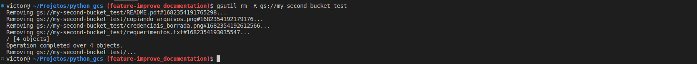
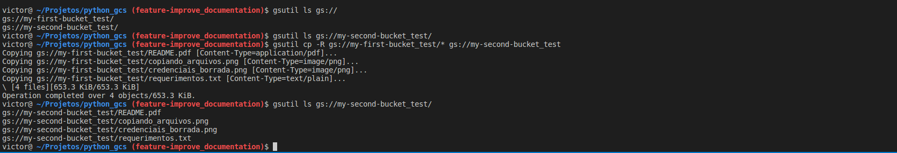

# Gerenciador de arquivos super simples utilizando Python e GCS

## Criando uma conta gratuíta (de teste) na GCS

* Acesse [GoogleCloudStorage](https://www.google.com/aclk?sa=l&ai=DChcSEwiPid74mrn-AhVq6FwKHZ6-AIIYABACGgJjZQ&sig=AOD64_0Bua6qNJPjx-4Ld0PHrzv5mV3Z0Q&adurl&ved=2ahUKEwj9i9f4mrn-AhWXH7kGHVJfBwgQqyQoAHoECAcQCw) para criar uma conta gratuíta.

* Necessário informar um cartão de crédito, mesmo que não seja cobrado.

## Instalando o gcloud cli
* Siga o tutorial disponível aqui [GoogleCloudCLI](https://cloud.google.com/sdk/docs/install?hl=pt-br) para a instalação. Lembrando que não ela não é necessária para que o python possa se conectar ao storage, apenas para que possamos utilizá-la através da Interface por Linha de Comando, através do terminal (como de fato sugere o termo cli). 

* Uma opção (das informadas no tutorial) muito simples é através do snap, para caso esteja em sistema linux debian based:
    - snap install google-cloud-cli --classic
    - Agora já é possível rodar gsutil e gcloud

## Exportando as variávies

- Realize o login:
    - gcloud auth login

* Exporte as credenciais de acesso:
    - gcloud auth application_default login
        - 

        - 

    - Desta forma, o endereço do json exportado pode ser usado agora como variável de ambiente, assim como foi feito neste repositório, para que seja possível o acesso ao storage através do python.

## Utilizando a ferramenta gsutil
`Uma vez instalado o cli, podemos agora acessar o storage da cloud através do terminal, uma vez estando logado.`

- Uma vez realizado o login, é possível ter acesso ao storage através do gsutil, o qual possui muitas das funcionalidades disponíveis em um terminal linux:

    * __Listando arquivos:__
        - `gsutil ls ou gsutil ls -flag`
            - 
            - 
            - 

    * __Copiando arquivos (ou fazendo upload):__
        - `gsutil cp origem.extensao gs://nome_bucket/destino.extensao`
        - `gsutil cp gs://nome_bucket/origem.extensao destino.extensao`
        - 

    * __Removendo arquivos:__
        - `gsutil rm gs://nome_bucket/arquivo.extensao`
        - 
        - Usando recursividade, o que remove o próprio bucket, usando desta forma:
        - `gsutil rm -R gs://my-second-bucket_test/*`
        - 

    * __Copiando arquivos de um bucket para outro(algo como um backup):__
        - Usando recursividade:
        - `gsutil cp -R gs://bucket_origem/* gs://bucket_destino`
        - 

    
    * __Fontes__: 
        - https://cloud.google.com/storage/docs/discover-object-storage-gsutil?hl=pt-br
        - https://cloud.google.com/storage/docs/gsutil/commands/help
        - https://github.com/victor-s-santos/python_gcs

